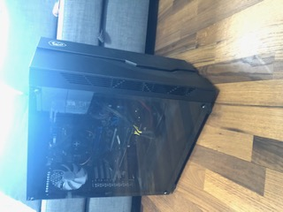
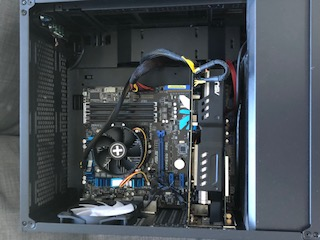

+++
title = "PC-Bauprojekt"
date = "2021-04-30"
draft = true
pinned = false
image = "7745772a-8534-453b-bc92-4d09f1a0ccd4-3-1-1-1-1-1-.jpg"
+++
Eines Meiner Hobbys ist: Neue und alte PCs zusammenstellen, bauen und auszumisten.                                                                  Seit ca. 3 Jahren betreibe ich dieses Hobby.  Mein Mentor Joris, weiss dies und hat mich angefragt, ob ich Lust und Zeit habe für ihn einen PC zusammenzustellen und zu bauen. Natürlich hatte ich Lust, einen PC zu bauen. Um einen Computer zu bauen, brauchte ich folgende Informationen: Welches Budget habe ich zur Verfügung und welche Funktionen soll der PC erfüllen. Aufgrund dieser Informationen konnte ich die Anforderungen des neuen PC herausfiltern. So erstellte ich eine Liste mit allen Komponenten, welche ich für der PC-Bau benötigte. Ich hatte total neun PCs  für Joris zusammengestellt. Für mich waren diese Komponenten die Besten, welche es zu dieser Zeit auf dem Markt gab bzw. die das Beste Preis-Leistungs-Verhältnis boten. Ich besprach die zusammengestellten Angebote mit Joris.  Joris war von den vielen, verschiedenen Möglichkeiten sehr beeindruckt und freute sich, dass ich mir so viel Zeit nahm, um so viele Varianten auszuarbeiten. Joris entschied sich für eine Variante und bestellte anschliessend die Teile. Als die Bestellung komplett war, ging ich zu Joris und half ihm, den PC zusammenzubauen. Als Gegenleistung bestellte Joris zwei Pizzas, welche wir genüsslich assen. Wir brauchten ca. 3 bis 4 Stunden um denn PC zusammenzubauen und aufzusetzen. Wir hatten einen tollen und lustigen Abend.  Ich bin stolz, dass der PC läuft und Joris mit meiner Arbeit zufrieden ist.

Hier noch ein Link zu einem Video wie ich denn PC zusammengebaut habe:

