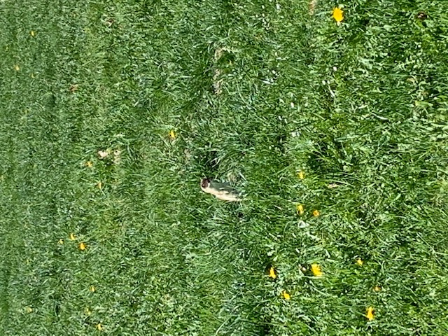
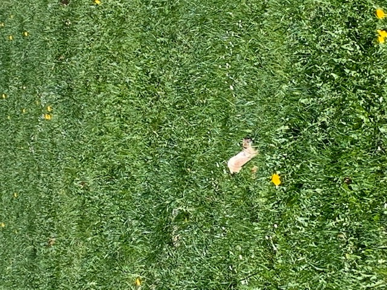
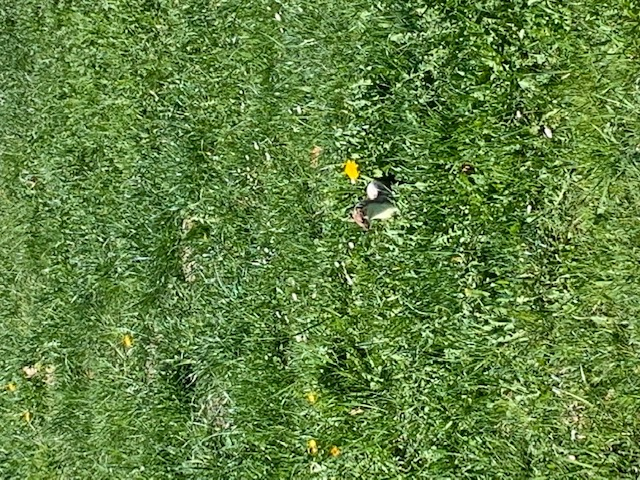

+++
title = "Alles Wiesel oder was?"
date = "2021-06-04"
draft = false
pinned = false
image = "img_8353-1-.png"
+++

Alles Wiesel oder was?

Im April und Mai, hatten wir sehr seltenen Besuch in unserer Weide. Bei uns flitzten zwei kleinere
und schlanke Tiere durch das Gras. Sind es kleine Marder welche in einem Mauseloch verschwinden
und innerhalb kürzester Zeit 10 Meter weiter entfernt, durch ein anderes Mauseloch frech
herausschauen? Nein, es sind keine Marder, da das Fell von einem Tier zur Hälfte weiss ist. So habe
ich ein paar Fotos gemacht und anschliessend im Internet nachgeschaut um welche Tiere es sich
handelt. Die Antwort war eindeutig. Es handelt sich um Wiesel oder Hermeline. Aber um welches
Wiesel? Wiesel, Hermelin, Mauswiesel, Grosses Wiesel. Wer ist was oder ist alles dasselbe. Des
Rätsels Lösung: Wiesel ist der Oberbegriff für die beiden Arten Hermelin und Mauswiesel. Somit
flitzen bei uns zwei Mauswiesel durch die Weide. Aber weshalb ist das eine Tier zur Hälfte weiss? Die
Wiesel oder Hermelin wechseln ihre Fellfarbe. Im Winter sind sie weiss und im Sommer rotbraun. Die
Wiesel sind Tunneljäger und ernähren sich vorwiegend von Wühlmäusen und sind deshalb sehr
beliebt in der Landwirtschaft. Da es nicht mehr viele Wiesel gibt, sind Sie geschützt. Ein Jäger hat mir
erzählt, dass es eine massive Busse geben würde, sollte man ein Wiesel jagen. Also Jönu, bitte die
Wiesel nicht jagen…
Leider sind unsere Wiesel weitergezogen. Ich hoffe jedoch, dass Sie im Herbst wieder retour
kommen, da es wirklich sehr spannend und lustig ist, den schnellen Flitzern zuzuschauen.

