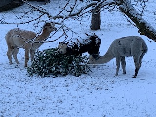
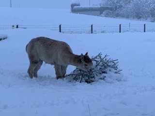
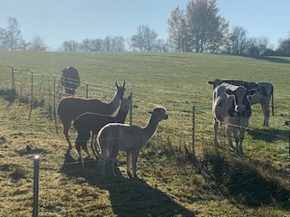

+++
title = "Alpaka-Hype!"
date = "2021-03-04"
draft = false
pinned = false
image = "img_4902.jpg"
+++
Freundlich und flauschig: Alpakas sind die Trend-Tiere!
Es leben ca. 4000 Alpakas und ca. 3000 Lamas in der Schweiz. Allein im letzten Jahr, hat sich die Anzahl Alpakas in der Schweiz angeblich verdoppelt.
Ursprünglich kommen die Tiere aus den Südamerikanischen Anden. Die ersten Lamas und Alpakas sind vor ca. 35 bis 40 Jahren in der Schweiz eingeführt worden. Die Tiere fühlen sich sehr heimisch und haben auch im kalten Winter keine Probleme. 

  Die Alpakas gehören zur Gruppe der Kameliden.  Es sind Schwielensohler und Wiederkäuer. Ihre Hufe sind wie ein Kissen und machen somit keine Schäden in der Weide. Zudem fressen Sie die Grashalme ab und reissen nicht die Grässer samt Wurzeln aus. Das ist sehr praktisch, da die Weide immer sehr gepflegt und wie frisch gemäht aussieht. Wir halten seit 2 Jahren Alpakas und hatten bis zum Ende des letzten Jahres auch zwei Lamas.  Beide Lamas lebten 28 Jahre (ein Lama oder Alpaka lebt in der Regel ca. 15 bis 20 Jahre). Die Lamas hatten wir vor 5 Jahren von unserem Nachbarn übernommen, da er aus gesundheitlichen Gründen nicht mehr zu den Tieren schauen konnte. Wir haben uns für Alpakas entschieden, da wir die Wolle der Tiere nutzen und verarbeiten. Einmal im Jahr, Ende April, werden unser Tiere geschert. Die Wolle wird zu Wollgarn verarbeitet. Die Beste Wolle ist auf dem Rücken, an der Flanke und am Hals. Es gibt pro Tier zwischen 2 und 4 Kilogramm Wolle.  Aus der Wolle lassen sich folgende Produkte herstellen: Mützen, Handwärme, Pullover, Schal und vieles mehr.  Aus der nicht so feinen Wolle, werden Duvets und Kissen hergestellt. Ich habe auch schon einen Kurs für die Herstellung von Alpakaseife besucht. Der Kot kann zudem auch als perfekten Gartendünger verwendet werden und ist bei Hobbygärtnern sehr beliebt. Lamas und Alpakas werden auch vermehrt als Herdenschutztiere eingesetzt. Zwei unserer Alpakas sind trächtig und werden im Juni ihre Babys bekommen. Ich freue mich bereits heute und bin gespannt, welche Farbe die Jungtiere haben, da man dies bei den Alpakas meist nicht vorhersagen kann. Ich hoffe jedoch, dass wir ein ganz weisses Baby-Alpaka bekommen, da ich die weissen Alpakas am schönsten finde. 

