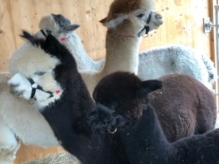
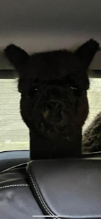

+++
title = "Alpaka Show 2021 – Drive In"
date = "2021-02-25"
draft = false
pinned = false
image = "image0-1-1-.png"
+++
Jährlich finden im Frühling und Herbst eine Alpaka-Show in der Schweiz statt. In Folge Corona, gab es im letzten Jahr keine Veranstaltungen und Shows. Auch in diesem Jahr, war oder ist es nicht sicher, ob man wieder grössere Veranstaltungen ausführen kann. Deshalb haben sich drei innovative Alpakazüchter überlegt, einen Weg zu finden, um eine Corona konforme Alpaka Show durchzuführen. Tatsächlich ist es ihnen gelungen, ein Konzept zu finden, um die BAG Richtlinien einzuhalten. Die Aussteller bekommen eine fixe Zeit zugeteilt, zu welcher Sie mit den Tieren in Ortschwaben bei Bern oder in Greifensee bei Zürich anfahren dürfen. Die Aussteller müssen die ganze Zeit im Auto bleiben. Die Tiere werden vom Richter und den beiden Helfern aus dem Anhänger in einen Catchpen gelassen. Die angemeldeten Tiere werden identifiziert und danach bewertet. Dabei werden die Faserproben, die der Richter nimmt zur Bestimmung der Feinheit, in vorbereiteten Tüten gesammelt. Nachdem alle Tiere des Ausstellers bewertet wurden, wird ein Dokument mit der Punktierung ausgedruckt, von den Richtern unterschrieben und dem Aussteller direkt nach Hause gegeben. Die Tiere werden vom Team verladen und der Aussteller kann wieder nach Hause fahren. Aus den Bewertungen werden dann die Klassensieger, Farb-Champions und Best of Show ermittelt. Bei Punktegleichstand treffen die Richter die Entscheidung anhand der gesammelten Faserproben. Die gesamte Show wird per livestream im Facebook übertragen. Zudem wird am Sonntag-Abend die Preisvergabe über eine Online-Abendveranstaltung stattfinden. Also fast wie Fernsehschauen! Über Zoom, können alle Interessierte, auch Nichtaussteller und Leute aus dem Ausland, teilnehmen. Den Pokal für das Alpaka, Best of Show, wird dem Besitzer direkt an die Haustüre überbracht und natürlich live übertragen. Unglaublich: 47 Züchter aus fast allen Regionen in der Schweiz haben 197 Alpakas angemeldet. Wir nehmen zum ersten Mal an einer Show teil und sind gespannt, wie unsere Silver Moon in der Kategorie: Multicolor, abschneiden wird. 

