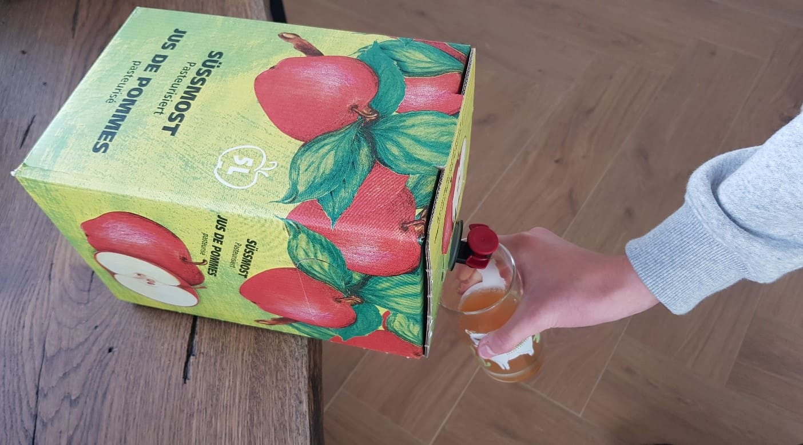

+++
title = "Apfelsaft von unserer Weide"
date = "2020-10-21"
draft = false
pinned = false
image = "apfelsaft.jpg"
+++
In unserer Alpakaweide hat es Zwei Apfelbäume. Wie jedes Jahr, ist im Herbst Erntezeit.
Pro Baum, ernten wir ca. 3 grosse Holzharassen. Die abgelesenen Äpfel, bringen wir zum Mosten nach Niederscherli. Unsere Äpfel werden nicht gespritzt und haben somit eine BIO Qualität! Deshalb sind unsere Äpfel
und der gewonnene Apfelsaft bei allen, sehr beliebt.
Der Geschmack ist einzigartig und absolut spitze.
Wir pressen jedes Jahr, ca. 200 Liter Apfelsaft (Natur pur!)

