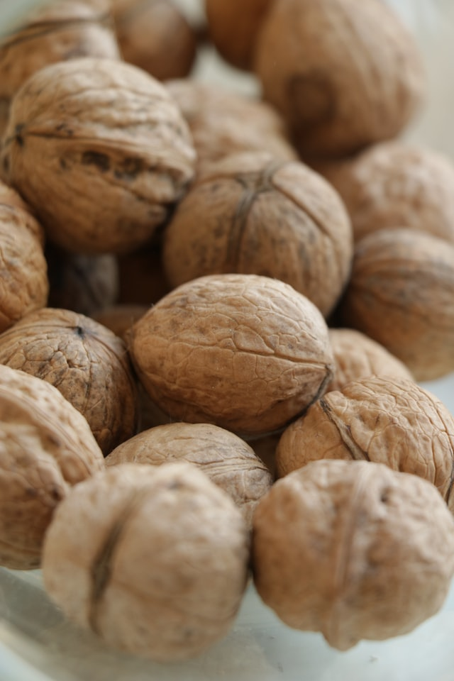

+++
title = "Baumnussöl-Pressen"
date = "2020-11-18"
draft = false
pinned = false
image = "daria-rudyk-hvt7wg9xo6e-unsplash.jpg"
description = ""
+++
\
In diesem Jahr konnten wir von unseren beiden Wahlnussbäumen viele Nüsse ernten. 
Wir haben die Nüsse aufgelesen, gereinigt und aussortiert. Normalerweise betreiben wir nicht so einen grossen Aufwand, da wir bis anhin die Nüsse getrocknet und anschliessend gegessen haben. Aber in diesem Jahr, möchten wir die Nüsse zu Baumnussöl verarbeiten. Um ein gutes Öl zu erhalten, müssen die Nüsse sauber gewaschen, gereinigt und gut getrocknet sein. Die Nüsse werden an einem trockenen Ort bis zum Frühjahr getrocknet und anschliessend entkernt. 
Wir bringen die Nusskerne zu einer Manufaktur nach Solothurn, wo die Kerne zu einem hochwertigen und köstlichen Öl gepresst werden. Die Nusskerne werden kalt gepresst und aus einem Kilogramm Kerne kann mit ca. 4 dl. Öl gerechnet werden. Der Omega-3- Fettsäuregehalt des Wahlnussöls ist sechsmal höher, wie jenes des Olivenöls. 
Das Baumnussöl gilt als das wertvollste und edelste Öl und wird vorwiegend in der kalten Küche verwendet oder um warme Gerichte mit beträufeln zu veredeln. 
Ich bin bereits heute gespannt, wie viel Öl wir aus unserer Ernte pressen können und ob das Öl wirklich so gut schmeckt wie oben beschrieben. 

