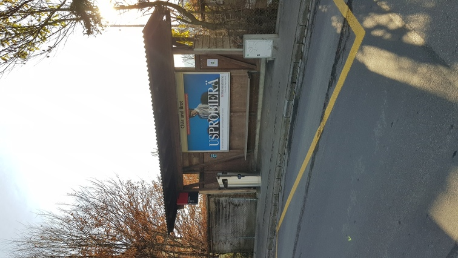

+++
title = "Bushaltestelle \"Chäs und Brot\""
date = "2020-11-23"
draft = false
pinned = false
image = "img-20201123-wa0000.jpg"
+++
Mehrmals in der Woche fahre ich bei der Bushaltestelle Chäs und Brot vorbei, welche sich in Bern-West befindet.
Ich habe mich schon oft gefragt wieso die Bushaltestelle Chäs und Brot heisst.
Deshalb habe ich mich informiert woher dieser Namen kommt und was er für eine Bedeutung hat. Ich war sehr erstaunt, was ich herausgefunden habe.
Ich fand heraus, dass sich dieser Name auf die Schlacht in Laupen von 1339 bezog.
Laupen war damals von freiburgischen und habsburgischen Truppen belagert. Am 21. Juni 1339 wurde Laupen unter anderem mit der Hilfe von befreundeten Truppen aus den Waldstätten und dem Haslital befreit.
Am Vortag der Schlacht verköstigten sich die Waldstätter und die Haslitaler in Bern-West (Oberbottigen), deshalb der Name: "Chäs und Brot". 

Zudem fragte man sich, wie man Freund von Feind unterscheiden könne. Eine Frau hatte die zündende Idee: Sie zerriss Leinentücher und brachte diese den Kämpfern kreuzweise auf ihren Hemden an.
Ich traute meinen Augen nicht, was ich bei meiner Recherche zusätzlich herausgefunden habe. Nämlich: «Die Bedeutung der oben erwähnten Kreuze auf den Hemden».
Wenn du meinen Blog bis hierhin gelesen hast, empfehle ich dir dringend, meinen nächsten Eintrag zu lesen.
Du wirst überrascht und auch erstaunt sein!

