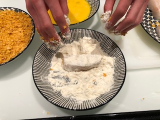
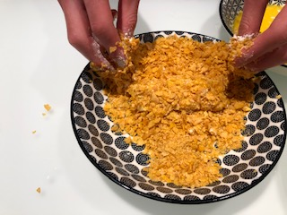
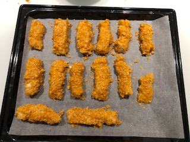
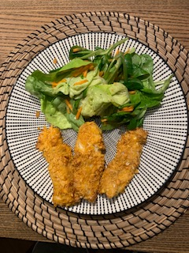

+++
title = "Fischknusperli selbst gemacht!"
date = "2021-03-11"
draft = false
pinned = false
image = "img_8161.jpg"
+++
Ich habe vor längerer Zeit ein YouTube Koch-Video angesehen, bei welchem sie Fischknusperli gemacht haben.         Dies hat mich inspiriert, selbst zu kochen. Deshalb habe ich im Betty Bossi Kochmagazin ein Rezept gesucht und gefunden. Ich fand das Rezept spannend, weil auch Cornflakes als Zutaten verwendet werden. Deshalb habe ich        am letzten Sonntag für meine Familie gekocht. Alle fanden das Essen super und gerne teile ich das Rezept mit euch. 

Ofen auf 2020 Grad vorheizen

600g Zanderfilet                                                                                             \
ein TL Salz
wenig Pfeffer
2 EL Mehl
2 Eier
100g Cornflakes

Fisch in ca. 8 gleich grosse Stücke schneiden, würzen. Mehl in einem flachen Teller geben. Eier in einem tiefen Teller verklopfen. Cornflakes grob zerbröseln, in einen flachen Teller geben. Fisch im Mehl wenden, überschüssiges Mehl abschütteln, im Ei, dann in den Cornflakes wenden, Panade gut andrücken und auf das Blech legen. 

10 Min in der oberen Hälfte des Ofens backen.

Ich habe dazu Salat und Pommes serviert. Ä Guetä mitänand.

