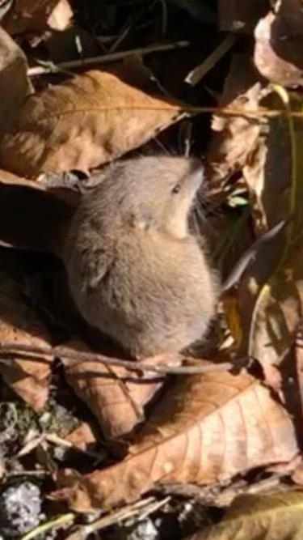

+++
title = "Maus im Keller"
date = "2020-10-27"
draft = false
pinned = false
image = "img-20201026-wa0000.jpg"
+++
Diesen Samstag hatten wir eine Maus im Keller, die wir einfangen mussten.

Zuerst haben wir in der Waschküche angefangen alles auf den Kopf zu stellen um die Maus zu finden. Da wir dort nicht fündig wurden, haben wir auch im Warenlager gesucht. Als erstes, habe ich unter einem Schrank nachgesehen und siehe da, dort war die Maus! Aber sie rannte davon und versteckte sich hinter den Bodenplatten, die wir vom Umbau noch hatten. Wir mussten alle Platten umstapeln. Als wir endlich fertig waren, hatten wir eine Absperre aus Karton gebaut. Doch der Karton viel um und die Maus rannte hinter einen kleinen Stapel Kartonschachteln.  Sie Hatte sich selber eingesperrt. Schliesslich konnten wir sie einfangen und haben die Maus in einen Karton gelegt und anschliessend auf der Weide frei gelassen.

