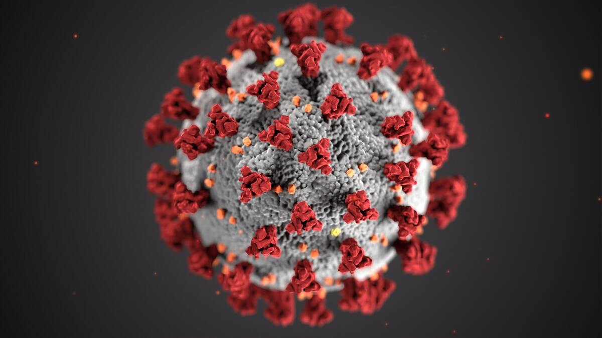

+++
title = "Projektwechsel"
date = "2020-11-04"
draft = false
pinned = false
image = "covid.jpg"
+++

Das Projekt: Jobbörse für Jugendliche,
welches ich zusammen mit Mael machen wollte ist für uns zu umfangreich gewesen. Deshalb haben wir beschlossen, dass wir ein neues Projekt in Angriff nehmen. Mael und ich werden nun, Passanten einige Fragen über Corona stellen und die Antworten in einer Statistik erfassen. Wir haben bereits, acht Personen diesbezüglich befragt und die Ergebnisse schriftlich festgehalten.
Unser Ziel ist es, möglichst viele Leute zu interviewen um ein aussagekräftiges Ergebnis zu erhalten. Selbstverständlich werden keine Namen der Passanten veröffentlicht und die persönlichen Antworten vertraulich behandelt. Wir freuen uns, Euch demnächst unser Ergebnis in einem weiteren Blog mitzuteilen.