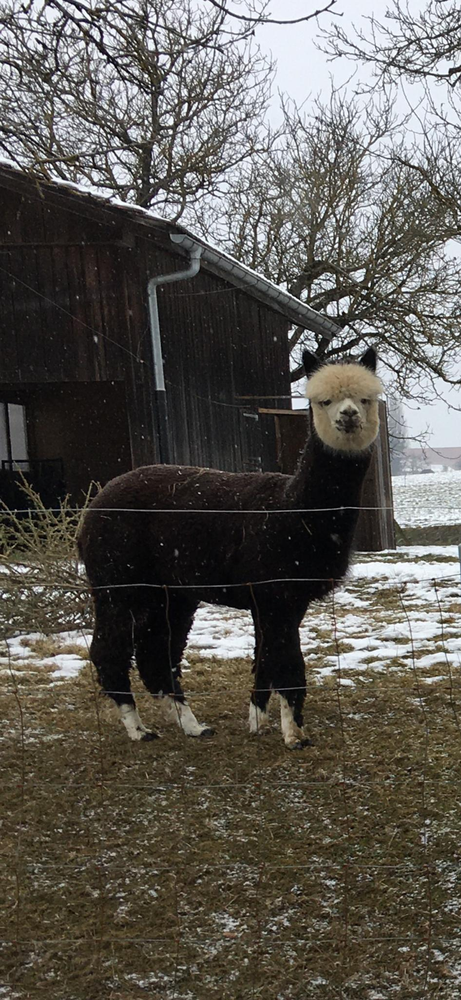
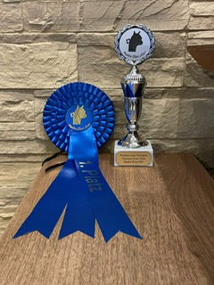
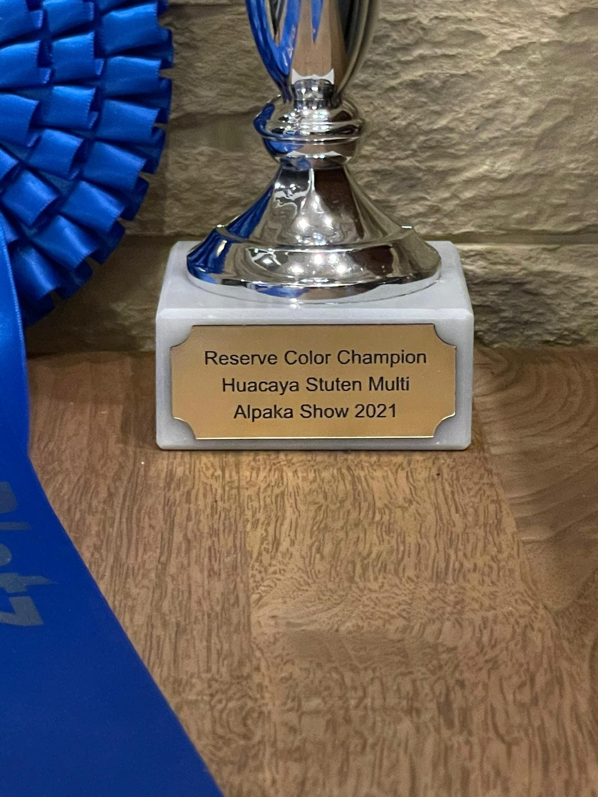

+++
title = "Reserve Color Champion Silver Moon Resultat Drive In Alpakashow 2021"
date = "2021-03-16"
draft = false
pinned = false
image = "image7.jpeg"
+++
Am letzten Sonntag war es endlich so weit. Die erste Drive In Alpakashow fand am letzten Freitag bis und mit Sonntag, den 14.03.2021 in Zürich und in Ortschwaben statt. Total wurden 199 Alpakas angemeldet und bewertet. Wie in einem meiner früheren Blogs erwähnt, haben wir unsere Silver Moon für die Show angemeldet. Wir wollten eigentlich mit unseren Tieren nicht an Shows teilnehmen. Mein Vater liess sich jedoch von der Züchterin, von welcher wir unsere Tiere gekauft haben, überreden, an der Show mitzumachen. Die Züchterin meinte noch, dass wir uns nicht allzu grosse Hoffnung für eine gute Platzierung machen sollen, da viele Spitzentiere von bekannten Züchtern an der Show teilnehmen werden. So fuhren wir ohne Erwartung nach Ortschwaben. Es war spannend zu sehen, wie die Juroren die Alpakas begutachten und bewerten. Ohne Ergebnis gingen wir nach Hause und sahen am Abend um 20:00 Uhr die Rangverkündigung mit Zoom im TV. Wir konnten kaum glauben, was wir gesehen bzw. gelesen haben, unsere Silver Moon hat den 1. Rang in ihrer Altersklasse gewonnen und noch viel besser, sie wurde zum Reserve Color Champion, Huacaya Stuten Multi gewählt. Das bedeutet, dass sie in dieser Kategorie das zweitbeste Alpaka in der Schweiz ist. Wir bekamen heute eine blaue Schleife für den 1. Rang ihrer Altersklasse sowie einen Pokal für den Titel: Reserve Color Champion zu uns nach Hause geliefert. Es war eine neue und spannende Erfahrung für uns. Wir wissen jedoch noch nicht, ob wir an weiteren Shows teilnehmen werden. Übrigens, unsere Silver Moon hat gestern Abend eine Extraportion Alpamin erhalten und war mit dieser viel glücklicher als mit dem gewonnenen Pokal. 

