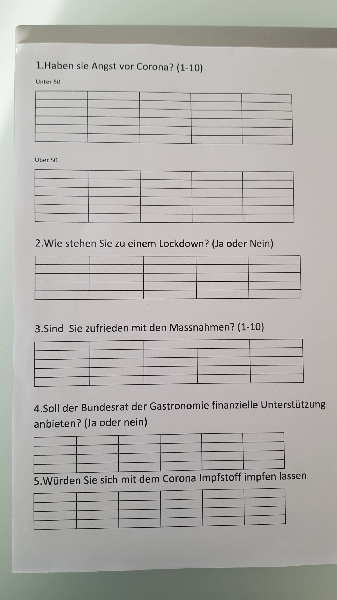

+++
title = "Status Update zum Projekt Corona"
date = "2020-11-12"
draft = true
pinned = false
image = "blog-2.jpg"
+++

Heute habe ich mich mit Mael getroffen und wir haben an unserem aktuellen Projekt gearbeitet.
Im Effinger und auf dem Bahnhofsgelände haben wir 15 Personen befragt. Es war interessant Passanten zum Thema Corona zu befragen und deren Meinungen festzuhalten. 

Ich freue mich schon heute, weitere Antworten zu unserer Umfrage zu notieren.
Unser Ziel ist es möglichst viele Personen zu Interviewen um eine genaue Statistik zu erhalten.