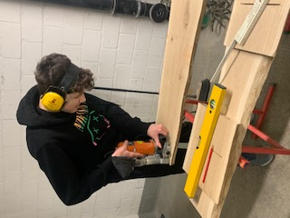
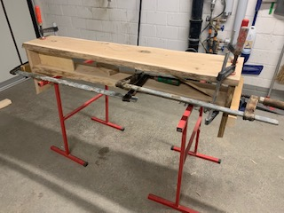
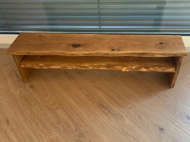
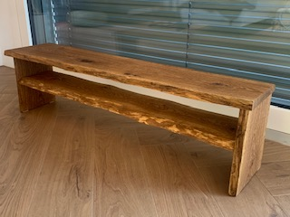

+++
title = "TV-Möbel selbstgemacht!"
date = "2020-12-08"
draft = false
pinned = false
image = "img_7734.jpg"
+++
Seit längerer Zeit, fehlt uns ein TV-Möbel. Da wir kein passendes Möbel gefunden haben, hatte ich die Idee, dass ich ein TV-Möbel für meine Familie anfertige.

Zusammen mit  meinem Vater habe ich Ideen gesammelt, wie wir das Möbel bauen könnten. Wir haben eine Skizze gezeichnet und haben uns für ein rustikales Massivholzmöbel aus Eichenbretter entschieden.

Die Bretter haben wir im Baumarkt meines Vertrauens für Fr. 45.00 gekauft.  Als erstes, habe ich die Bretter auf die richtigen Masse zu geschnitten. Anschliessend machte ich mit der Lamellomaschine die Eckverbindungen.

Als nächstes habe ich und mein Vater die Bretter verleimt. Über Nacht, konnte der Leim trocknen. Nun habe ich das Möbel und die Kanten nicht zu rund und eckig geschliffen. Ich habe den Schleifstaub entfernt und mit einem Naturöl das Möbel geölt.

Nach fünf Stunden Trocknungszeit, war mein Projekt fertig.

Mein Bruder und meine Mutter finden das Möbel spitze und konnten es nicht glauben, dass ich dieses Möbel fast alleine gebaut habe.

**Ich bin der Meinung, dass es sich lohnt, ein Möbel selbst zu bauen, da es Spass macht, sehr preiswert ist und zudem super aussieht.**

