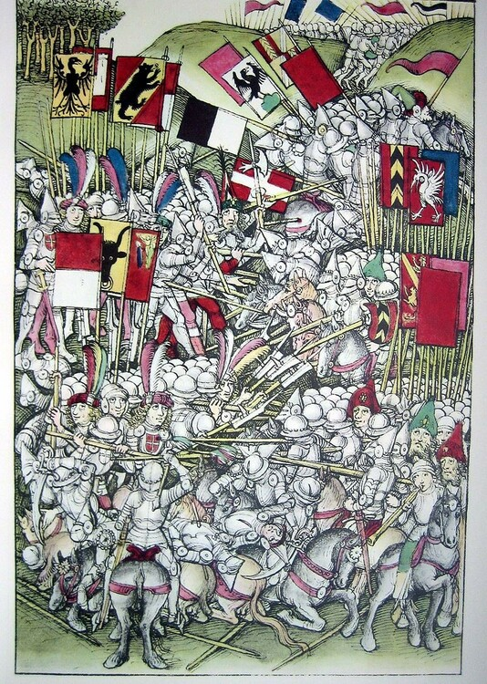

+++
title = "«Chäs und Brot» = Schweizerkreuz?  "
date = "2020-12-02"
draft = false
pinned = false
image = "4444444444444444444444444444.jpg"
+++
Wie in meinem letzten Blogg geschrieben, haben sich die Haslitaler und Waldstätter am Vortag der Schlacht bei Laupen von 1339 im heutigen Oberbottigen gesammelt und verpflegt. Damit man Freund von Feind unterscheiden konnte, hatte eine Frau die Idee, aus Leinentücher Kreuze herzustellen und diese auf die Kettenhemden zu nähen. 
Gemäss dem EDA (Eidgenössisches Departement für auswärtige Angelegenheiten) war dies die Geburtsstunde des Schweizerkreuzes in unserer Nationalflagge. Ich war doch sehr erstaunt, was ich herausfand, da ich 8 Jahre in Oberbottigen gewohnt habe und die Geschichte der Entstehung des Schweizerkreuzes nicht kannte. Ich fand das Gelesene so cool, dass ich meine Freunde und ehemalige Nachbarn aus Oberbottigen gefragt habe, ob sie diese kennen. Ich war nicht sonderlich erstaunt, dass keiner meiner Freude dies wusste. Es ist eigentlich schade, dass am 20. Juni kein jährliches Fest in Oberbottigen veranstaltet wird, um dies zu feiern und die Kinder in der Schule Oberbottigen nicht über diese tolle Geschichte informiert werden.  Ich fand zudem heraus, dass es weltweit 195 Staaten und nur zwei Länder mit einer Quadratischen Flagge gibt. 
Nämlich: Die Schweiz und die Vatikanstadt (Vatikanstaat). Die Vatikanstadt ist der kleinste Staat der Welt und misst gerade mal 0.44 km2.
Für mich war es spannend und auch ein wenig faszinierend, wie aus dem Namen «Chäs und Brot» so eine tolle Geschichte und viel Wissen entstand.

